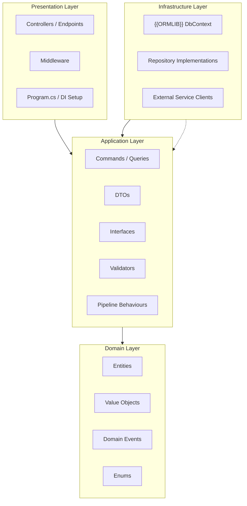
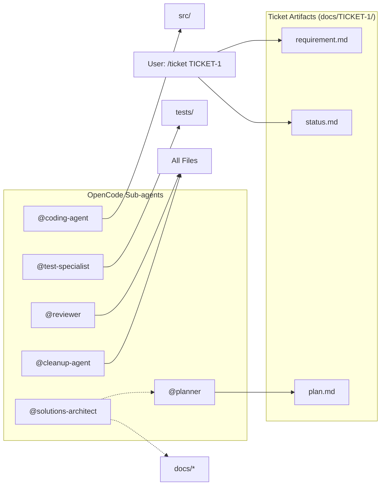
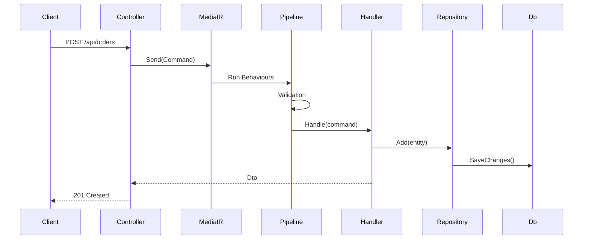

# Scaffold Skill

Generates a fully customized OpenCode configuration tailored to the
detected project stack and developer preferences.

## Phase 1: Deep scan

Run these scans to auto-detect as much as possible. Record all results.

### Solution & project detection

- Glob `*.sln` — if found, read the solution name from the file header.
- If no `.sln`, glob `*.csproj` — infer root namespace from the main
  project's `RootNamespace` property or directory name.
- Collect all `.csproj` paths.

### Package detection (per .csproj)

For each `.csproj`, grep for `PackageReference` and identify:

| Category | Packages to check |
|----------|-------------------|
| Test SDK | `MSTest.TestAdapter`, `xunit.runner.visualstudio`, `NUnit3TestAdapter` |
| Mock lib | `NSubstitute`, `Moq`, `FakeItEasy` |
| ORM | `Microsoft.EntityFrameworkCore`, `Dapper`, `NHibernate` |
| Web | `Microsoft.AspNetCore.App`, `Swashbuckle` |
| Logging | `Serilog`, `NLog`, `log4net` |
| Mapping | `AutoMapper` |
| CQRS | `MediatR` |

Set the detected framework values (e.g., `test_framework = "xUnit"`).
If multiple found, ask the user to pick.

### Structure analysis

- Check if `src/` directory exists → `has_src_folder`
- Check if `tests/` directory exists → `has_tests_folder`
- Check for existing `.opencode/`, `opencode.json`, `AGENTS.md`
- Check `.editorconfig` for `indent_style`, `indent_size`, `charset`
- Check `.gitignore` and `.gitattributes`
- Check `.github/workflows/` or `azure-pipelines.yml` or `.gitlab-ci.yml`

### Code pattern sampling

Read 2-3 representative `.cs` files and detect:

| Pattern | What to look for |
|---------|-----------------|
| Nullable enabled | `#nullable enable` or `<Nullable>enable</Nullable>` in csproj |
| Namespace style | `namespace Foo.Bar;` (file-scoped) vs `namespace Foo.Bar { ... }` (block) |
| Private field style | `_camelCase` vs `_CamelCase` vs `camelCase` |
| Exception handling | `Result<T>` usage vs plain `throw` |
| Primary constructors | `class Foo(IBar bar)` syntax |

## Phase 2: Questions

Ask the developer to confirm or fill in anything not detected.

Build the questions dynamically — skip what was already detected. Example:

1. "Solution name: [{{detected_value}}] — correct?"
2. "Root namespace: [{{detected_value}}] — correct?"
3. "Test framework: MSTest / xUnit / NUnit / None (detected: {{detected}})"
4. "Mock library: NSubstitute / Moq / FakeItEasy / None (detected: {{detected}})"
5. "ORM: Entity Framework Core / Dapper / NHibernate / None (detected: {{detected}})"
6. "Architecture pattern: Clean Architecture / N-tier / Onion / Custom :"
7. "CI platform: GitHub Actions / Azure DevOps / GitLab CI / None"
8. "Formatter command (e.g., `dotnet format` or `dotnet csharpier`):"
9. *.NET version (from TFM in csproj, e.g., `net8.0`):"
10. "Any custom coding conventions to add to AGENTS.md? (paste or describe)"
11. "Overwrite existing OpenCode config? [Y/n]"

## Phase 3: Build substitution map

Compile all detected + answered values into a flat dictionary:

```
TEST_FRAMEWORK=MSTest
TEST_SKILL=dotnet-testing
TEST_CLASS_ATTR=[TestClass]
TEST_CLASS_ATTR_XML=TestClass
TEST_METHOD_ATTR=[TestMethod]
TEST_DATA_METHOD=[DataTestMethod]
TEST_DATA_ROW=[DataRow]
MOCK_LIBRARY=NSubstitute
MOCK_USING=using NSubstitute;
MOCK_CREATE=Substitute.For<T>()
MOCK_RECEIVE=Received()
ORMLIB=Entity Framework Core
ARCH_PATTERN=Clean Architecture
SOLUTION_NAME=MySolution
ROOT_NAMESPACE=MyCompany.MySolution
DOTNET_VERSION=net8.0
CI_PLATFORM=GitHub Actions
FORMATTER_CMD=dotnet format
HAS_SRC_FOLDER=true
HAS_TESTS_FOLDER=true
NULLABLE_ENABLED=true
FILE_SCOPED_NS=true
CUSTOM_RULES=<user input>
INCLUDE_SOLUTIONS_ARCHITECT=true
INCLUDE_ARCH_SKILL=true
```

### Test framework mapping

| Detected | {{TEST_SKILL}} | {{TEST_CLASS_ATTR}} | {{TEST_METHOD_ATTR}} | {{TEST_DATA_ROW}} |
|----------|---------------|--------------------|--------------------|-------------------|
| MSTest | dotnet-testing | `[TestClass]` | `[TestMethod]` | `[DataRow]` |
| xUnit | xunit-testing | (not needed) | `[Fact]` | `[InlineData]` |
| NUnit | nunit-testing | `[TestFixture]` | `[Test]` | `[TestCase]` |

### Mock library mapping

| Detected | {{MOCK_USING}} | {{MOCK_CREATE}} | {{MOCK_RECEIVE}} |
|----------|---------------|----------------|------------------|
| NSubstitute | `using NSubstitute;` | `Substitute.For<T>()` | `.Received()` |
| Moq | `using Moq;` | `new Mock<T>().Object` | `.Verify()` |
| FakeItEasy | `using FakeItEasy;` | `A.Fake<T>()` | `A.CallTo()" |

## Phase 4: File generation — method

For each template defined below (look for fenced code blocks with
`template:` in the info string):

1. Read the full code block text.
2. Replace every `{{PLACEHOLDER}}` with the value from the substitution map.
3. If `{{CUSTOM_RULES}}` is non-empty, insert it at the marked location
   in AGENTS.md. If empty, remove the marker line.
4. If a conditional file should be skipped (e.g., architecture skill when
   no arch pattern selected), omit it entirely.
5. Write the result to the output path listed in the template header.
6. Create parent directories as needed.

### File conditions

| Template | Condition to write |
|----------|-------------------|
| `solutions-architect.md` | `{{INCLUDE_SOLUTIONS_ARCHITECT}}` = true |
| `architecture skill` | `{{INCLUDE_ARCH_SKILL}}` = true |
| `test-specialist.md` | `{{TEST_FRAMEWORK}}` != None |
| `{test}-testing skill` | `{{TEST_FRAMEWORK}}` != None; use matching skill name |
| `docs/architecture.md` | `{{INCLUDE_ARCH_SKILL}}` = true |

---

## Templates

---

### Template: AGENTS.md

```
path: ./AGENTS.md
```

```yaml template:AGENTS.md
# AGENTS.md — Project Instructions

This file is loaded at the start of every session. It defines the standards,
workflow, and expectations for all work in this repository.

---

## 1. Purpose

This is a {{SOLUTION_NAME}} project using {{ARCH_PATTERN}} with
{{TEST_FRAMEWORK}} for testing. The setup is designed to be adaptable to
any project size or type within the {{ROOT_NAMESPACE}} namespace.

See `docs/stack.md` for the current technology stack and
`docs/architecture.md` for the solution architecture diagram.

## 2. Coding Standards

- **Naming**: PascalCase for classes, methods, properties, namespaces, and
  public members. `_camelCase` for private fields. camelCase for local
  variables and parameters.
- **File layout**: One type per file (exceptions: small enums, DTOs).
- **Documentation**: XML docs on all public APIs — summary, params, returns.
  Minimalist inline comments; prefer clear code over comments.
- **Null handling**: Enable nullable reference types. Use
  `ArgumentNullException.ThrowIfNull`.
- **Patterns**:
  - Constructor injection for dependencies (never property injection).
  - Interfaces for all services, repositories, and handlers.
  - Immutable DTOs and commands (`record` types).
  - Async all the way: suffix async methods with `Async`.
- **Error handling**: Use `Result<T>` or `OneOf` for expected failures;
  throw only for programmer errors.
- **Formatting**: {{EDITORCONFIG_INDENT}}-space indentation, no tabs. Follow
  `.editorconfig` if present.
{{CUSTOM_RULES}}
## 3. Testing Standards ({{TEST_FRAMEWORK}})

Apply the **{{TEST_SKILL}}** skill for full details. Key rules:
- Test naming: `MethodName_StateUnderTest_ExpectedBehavior`
- Use `{{TEST_METHOD_ATTR}}` for unit tests, `{{TEST_DATA_ROW}}` for
  parameterised.
- AAA (Arrange-Act-Assert) with blank line separators.
- Mock external dependencies with {{MOCK_LIBRARY}}; never mock system under
  test.

## 4. Git Workflow

Apply the **git-conventions** skill for full details. Key rules:
- Branch: `feat/TICKET-N`, `fix/TICKET-N`, `chore/TICKET-N`
- Commits: conventional commits (`feat:`, `fix:`, `test:`, `chore:`,
  `refactor:`). Imperative mood, 50-char subject, body wraps at 72.
- Commit early, commit often — each commit should compile and pass tests.

## 5. Architecture

Apply the **architecture** skill for full details. Key rules:
- **Domain layer**: Entities, Value Objects, Domain Events, Enums. Zero
  dependencies.
- **Application layer**: Commands/Queries, DTOs, Interfaces (not
  implementations), Mapping profiles. Depends only on Domain.
- **Infrastructure layer**: Persistence ({{ORMLIB}}), external services,
  file system. Depends on Application.
- **Presentation layer**: Controllers, Middleware, Program.cs. Depends on
  Application.
- Follow SOLID principles. Use MediatR for cross-cutting (validation,
  logging).

## 6. Ticket Workflow

Apply the **ticket-workflow** skill for full details. Standard flow:

1. Create branch: `git checkout -b feat/TICKET-N`
2. Create `docs/TICKET-N/requirement.md` with the format:
   - `# TICKET-N: Title`
   - `## Requirements` (bullet list)
   - `## Acceptance Criteria` (checked list)
   - `## Notes` (implementation hints, links)
3. Start work via `/ticket TICKET-N` or by saying "Work on TICKET-N".
4. The agent will:
   - Read `docs/TICKET-N/requirement.md` and any existing
     `docs/TICKET-N/status.md`
   - Invoke `@planner` to design → writes `docs/TICKET-N/plan.md`
   - Invoke `@coding-agent` to implement
   - Invoke `@test-specialist` to add/update tests
   - Invoke `@reviewer` to review changes
   - Collect documentation flags from planner, coding-agent,
     test-specialist, and reviewer
   - Invoke `@solutions-architect` to process all flags and update docs
   - Invoke `@cleanup-agent` for final polish (code only)
   - Update `docs/TICKET-N/status.md` with progress summary

## 7. Sub-agent Usage

| Sub-agent | When to use |
|-----------|-------------|
| `@planner` | New ticket start. Produces a per-ticket implementation plan working within the existing architecture. Read-only. Never makes architecture decisions — escalates them to solutions-architect. |
| `@coding-agent` | Writing or modifying production code. |
| `@test-specialist` | Writing or fixing tests. Has {{TEST_SKILL}} skill context. |
| `@reviewer` | After implementation is done. Reviews code, tests, standards. Read-only. |
| `@cleanup-agent` | Final pass: adds minimal constructive comments, removes AI conversational artifacts, formats whitespace, organizes imports. |
| `@solutions-architect` | Designing the overall solution structure, choosing technologies, defining high-level architecture, maintaining `docs/architecture.md` and `docs/stack.md`. Reviews planner's plans for architectural consistency. All architecture decisions go through this agent. |

The primary agent orchestrates the workflow. Use sub-agents sequentially,
not in parallel. After each sub-agent finishes, inspect the result before
calling the next.

## 8. Skills System

Skills are reusable instruction sets registered under `.opencode/skills/`.
Each skill has a `description` containing trigger keywords — when those
keywords match the conversation, the skill is auto-loaded and its
instructions become available.

Agents reference skills by name in their prompts. For example, the
test-specialist's description includes "{{TEST_FRAMEWORK}}" which matches
the {{TEST_SKILL}} skill description, ensuring the skill is loaded when
that agent is active.

To create a new skill: add a folder under `.opencode/skills/<name>/` with a
`SKILL.md` containing `name` and `description` frontmatter.

## 9. Communication Rules

- No conversational AI phrases ("As an AI...", "Let me know if...",
  "I hope this helps...").
- Be direct and technical.
- Acknowledge with "Done" or the minimal needed response.
- When reporting errors, provide the exact error message and location.
```

---

### Template: opencode.json

```
path: ./opencode.json
```

```json template:opencode.json
{
  "$schema": "https://opencode.ai/config.json",
  "instructions": ["AGENTS.md"],
  "default_agent": "build",
  "skills": {
    "paths": [".opencode/skills"]
  },
  "agent": {
    "planner": {
      "description": "Designs solutions: reads requirements, creates architecture plan, writes plan.md.",
      "mode": "subagent",
      "permission": {
        "edit": "deny",
        "bash": "ask"
      }
    },
    "solutions-architect": {
      "description": "Designs overall solution structure, selects technology stack, creates and maintains docs/architecture.md and docs/stack.md, and advises on high-level architecture decisions.",
      "mode": "subagent",
      "permission": {
        "edit": "allow",
        "bash": "ask"
      }
    },
    "coding-agent": {
      "description": "Implements production code following AGENTS.md standards and the plan.",
      "mode": "subagent"
    },
    "test-specialist": {
      "description": "Writes and maintains {{TEST_FRAMEWORK}} unit tests using the {{TEST_SKILL}} skill.",
      "mode": "subagent"
    },
    "reviewer": {
      "description": "Read-only code review: checks standards, patterns, tests, and architecture compliance.",
      "mode": "subagent",
      "permission": {
        "edit": "deny",
        "bash": "ask"
      }
    },
    "cleanup-agent": {
      "description": "Final cleanup pass: add minimal instructive comments, remove AI conversational artifacts, organize imports, fix whitespace.",
      "mode": "subagent",
      "permission": {
        "edit": "allow",
        "bash": "ask"
      }
    }
  },
  "command": {
    "ticket": {
      "description": "Start work on a ticket, e.g. /ticket TICKET-1",
      "template": "Read docs/{arg}/requirement.md and docs/{arg}/status.md (if exists). Follow the workflow in AGENTS.md. Use sub-agents: @planner -> @coding-agent -> @test-specialist -> @reviewer -> @solutions-architect -> @cleanup-agent. Collect doc flags from each agent and pass them to @solutions-architect. After completing, update docs/{arg}/status.md with progress.",
      "agent": "build"
    }
  }
}
```

---

### Template: planner.md

```
path: ./.opencode/agent/planner.md
```

```yaml template:planner
---
description: Produces per-ticket implementation plans: sequences work, identifies files to create/modify, and defines the test strategy. Works within the existing architecture — never makes architecture decisions.
mode: subagent
permission:
  edit: deny
  bash: ask
---

# @planner

You are the **planner** sub-agent. You produce a detailed implementation
plan for a single ticket, working strictly within the architecture and
patterns already established by `@solutions-architect`. You never make
architecture decisions (that is the solutions-architect's role). You have
read-only access.

## Workflow

1. Read `docs/TICKET-N/requirement.md` and any existing
   `docs/TICKET-N/status.md`.
2. Understand the existing codebase — scan layers, read existing code for
   patterns to follow.
3. Consult `docs/architecture.md` and `docs/stack.md` for the established
   architecture. Do NOT propose changes to the architecture itself.
4. Produce a structured plan with these sections:
   - **Overview** — 1-2 sentence summary of what the ticket builds
   - **Layers Affected** — which existing layers are touched and how
   - **New Types** — classes, interfaces, records, enums to create (name,
     layer, purpose, key methods)
   - **Modified Types** — existing types to change and what changes
   - **Implementation Order** — sequence of file creation/edits with
     dependencies noted
   - **Edge Cases & Risks** — things to watch out for
   - **Test Strategy** — what to test and at which layer
5. Output the full plan as a code block for the primary agent to write to
   `docs/TICKET-N/plan.md`.

## Rules

- Never edit files. Output the plan as response text.
- Never make architecture decisions. If you encounter an ambiguity that
  requires an architecture decision, flag it for the primary agent to
  escalate to `@solutions-architect`.
- Be specific: include type names, method signatures, and file paths.
- Reuse existing patterns found in the codebase.

## Documentation flags

If the requirement implies a change outside the existing architecture (new
library, new pattern, layer boundary change), flag it with full detail:

```
Requires architecture decision: <description>
Suggested doc updates:
  - docs/stack.md: add <library> row to <section>
  - docs/architecture.md: update <diagram or section>
  - AGENTS.md: add/update <rule>
Content for each update: <specific text or snippet>
```
```

---

### Template: coding-agent.md

```
path: ./.opencode/agent/coding-agent.md
```

```yaml template:coding-agent
---
description: Implements production code following AGENTS.md standards and the plan.
mode: subagent
---

# @coding-agent

You are the **coding-agent** sub-agent. You write production code following
the standards in AGENTS.md and the design from `plan.md`.

## Workflow

1. Read `plan.md` to understand what to implement.
2. Read `requirement.md` for context.
3. Scan existing code in affected layers to match patterns and conventions.
4. Implement each item from the plan, one at a time.
5. Ensure code compiles before moving to the next item.

## Standards reminder

- PascalCase for public members, `_camelCase` for private fields.
- XML docs on all public APIs.
- Constructor injection, never property injection.
- `record` types for DTOs, commands, queries.
- `IReadOnlyList<T>` for exposed collections; never `List<T>`.
- Async suffix on async methods.
- No magic strings/numbers — use constants or enums.
- Prefer `is`/`is not` over `==`/`!=` for null checks.
- Use `ArgumentNullException.ThrowIfNull` in public methods.

## Documentation flags

After implementing, identify any documentation gaps. Report to the primary
agent with specific detail:

```
Documentation updates needed:
  - Package added: <name@version> -> docs/stack.md: add row to <table>
  - New pattern introduced: <description> -> docs/architecture.md: add
    section on <topic>
  - Convention changed: <old> -> <new> -> AGENTS.md: update section <N>
  - Config change: <key:value> -> docs/stack.md: update <section>
Content: <specific text or snippet for each update>
```
```

---

### Template: test-specialist.md

```
path: ./.opencode/agent/test-specialist.md
```

```yaml template:test-specialist
---
description: Writes and maintains {{TEST_FRAMEWORK}} unit tests using the {{TEST_SKILL}} skill. Use when writing new tests or fixing existing tests.
mode: subagent
---

# @test-specialist

You are the **test-specialist** sub-agent. You write and maintain unit tests
using {{TEST_FRAMEWORK}}, {{MOCK_LIBRARY}}, and FluentAssertions.

## Workflow

1. Read `plan.md` for the test strategy.
2. Read relevant source code to understand what to test.
3. Scan existing tests for conventions and patterns.
4. Write tests covering:
   - Happy path
   - Edge cases (nulls, empty collections, boundary values)
   - Error paths (validation failures, not-found, unauthorized)
5. Run `dotnet test` and fix any failures.
6. Report coverage gaps.

## Conventions

- Test naming: `MethodName_StateUnderTest_ExpectedBehavior`
- Test file: one test class per source class, in the matching namespace
  under `*.Tests`.
- Use `{{TEST_CLASS_ATTR}}` on test classes.
- Use `{{TEST_METHOD_ATTR}}` for unit tests, `{{TEST_DATA_ROW}}` for
  parameterised.
- AAA structure with blank line separators.
- Mock external dependencies with {{MOCK_LIBRARY}}; never mock the system
  under test.
- Prefer state-based assertions over interaction-based ones.

## Documentation flags

If tests introduce new infrastructure (new mocking strategy, fixture
pattern, test category, test dependency), flag it with full detail:

```
Documentation updates needed:
  - Test infra change: <description> -> docs/stack.md: update Testing table
  - New pattern: <description> -> {{TEST_SKILL}} skill: add section
Content: <specific text or snippet for each update>
```
```

---

### Template: reviewer.md

```
path: ./.opencode/agent/reviewer.md
```

```yaml template:reviewer
---
description: Read-only code review: checks standards, patterns, tests, and architecture compliance.
mode: subagent
permission:
  edit: deny
  bash: ask
---

# @reviewer

You are the **reviewer** sub-agent. You review code for compliance with
AGENTS.md standards. You never edit files — you report findings for the
primary agent to fix.

## Review checklist

### Code standards
- PascalCase public / `_camelCase` private?
- XML docs on all public APIs?
- Nullable reference types enabled, `ThrowIfNull` used?
- No magic strings/numbers?
- Constructor injection, no property injection?
- `IReadOnlyList<T>` for exposed collections?
- Async methods suffixed with `Async`?

### Architecture
- Dependencies flow inward (Domain → Application → Infrastructure →
  Presentation)?
- Application layer has no Infrastructure references?
- Controllers only depend on Application layer?
- Repositories are interfaces in Domain/Application, implementations in
  Infrastructure?

### Tests
- Tests exist for all new public methods?
- Happy path + edge cases + error cases covered?
- AAA structure followed?
- No mocks on system under test?
- No test depends on another test (ordering)?
- `{{TEST_CLASS_ATTR}}` / `{{TEST_METHOD_ATTR}}` used correctly?
- `dotnet test` passes?

### Documentation
- Do code changes diverge from `docs/architecture.md` or `docs/stack.md`?
- Are any `docs/` references outdated?
- Flag any drift with exact file, line, and suggested content.

### Cleanup
- No AI conversational comments ("As an AI...", "Let me know if...")?
- No commented-out code?
- No `TODO` or `FIXME` left without a ticket reference?

## Output format

For each issue found, provide:
- File and line number
- Severity: `BLOCKER` | `MAJOR` | `MINOR`
- Description of the issue
- Suggested fix (but don't edit the file)

If no issues found, respond with "**Approved.**"
```

---

### Template: cleanup-agent.md

```
path: ./.opencode/agent/cleanup-agent.md
```

```yaml template:cleanup-agent
---
description: Final cleanup pass: add minimal instructive comments, remove AI conversational artifacts, organize imports, fix whitespace. Non-breaking changes only.
mode: subagent
permission:
  bash: ask
---

# @cleanup-agent

You are the **cleanup-agent** sub-agent. You make non-breaking improvements
to the codebase. You never change logic, signatures, or behavior.

## Allowed changes

1. **Add minimal constructive comments** — only where the intent is not
   obvious from the code. One line per comment. No redundant explanations.
2. **Remove AI conversational artifacts** — phrases like:
   - "As an AI language model..."
   - "Let me know if you have any questions..."
   - "I hope this helps!"
   - "Please feel free to reach out..."
   - "Certainly! Here's..."
   - "I'd be happy to..."
   - Any overly polite or conversational boilerplate in code comments.
3. **Organize imports/usings** — remove unused, sort alphabetically.
4. **Fix whitespace** — trailing spaces, missing final newline, inconsistent
   blank lines.
5. **Fix formatting** — indentation, line length, brace placement (matching
   existing conventions in the file).

## Disallowed changes

- Changing any logic, algorithm, or behavior
- Renaming types, methods, variables, or files
- Adding or removing parameters
- Changing access modifiers
- Changing any visible behavior or API surface

## Documentation scanning

Also scan `docs/*.md` for:
- AI conversational artifacts (polite boilerplate, "As an AI...", etc.)
- Stale or inaccurate content (check against current code)
- Formatting issues (whitespace, broken markdown, missing final newline)

Do NOT edit `docs/` files directly. Flag each issue:

```
docs flag: <file>:<line> - <description>
Suggested fix: <specific edit>
```

## Workflow

1. Scan all code files touched in this ticket/feature.
2. Scan `docs/*.md` for issues (flag only, do not edit).
3. Apply all allowed changes to code files only.
4. Verify the project still compiles (`dotnet build` or `{{FORMATTER_CMD}}`).
5. Report all documentation flags to the primary agent.
```

---

### Template: solutions-architect.md

```
path: ./.opencode/agent/solutions-architect.md
```

```yaml template:solutions-architect
---
description: Designs overall solution structure, chooses technologies, defines high-level architecture, maintains docs/architecture.md and docs/stack.md, and advises on high-level architecture decisions.
mode: subagent
permission:
  edit: allow
  bash: ask
---

# @solutions-architect

You are the **solutions-architect** sub-agent. You own ALL architecture
decisions for the solution. The `@planner` never makes architecture
decisions — that is your exclusive domain.

## Responsibilities

1. **Solution structure** — Define the project layout (layers, projects,
   folders) and document it in `docs/architecture.md`.
2. **Technology stack** — Choose frameworks, libraries, and tools. Maintain
   `docs/stack.md` with version numbers and rationale.
3. **Architecture diagram** — Create and maintain the mermaid diagram in
   `docs/architecture.md` showing layers, dependency flow, and component
   interactions.
4. **Cross-cutting concerns** — Define patterns for logging, validation,
   error handling, authentication, authorization, and caching.
5. **Design review** — When `@planner` produces a plan, review it for
   architectural consistency before implementation begins. Approve, reject,
   or amend as needed.
6. **Escalation** — When `@planner` flags an architecture ambiguity, make
   the decision and update the docs accordingly.
7. **Documentation** — Keep `docs/` up to date whenever new technology or
   patterns are introduced.

## Workflow

1. For a new project: design the solution structure, select the stack,
   scaffold projects, and write initial `docs/stack.md` and
   `docs/architecture.md`.
2. For a new ticket: review the planner's plan before coding starts. If
   it makes any architecture decision, flag it.
3. For an existing project: periodically audit `docs/architecture.md` and
   `docs/stack.md` for accuracy.

## Post-implementation documentation update

After all other sub-agents finish, collect their documentation flags:

| Agent | Flags produced |
|-------|----------------|
| planner | Architecture decisions requiring doc changes |
| coding-agent | Package additions, new patterns, convention changes |
| test-specialist | Test infra changes, new testing patterns |
| reviewer | Drift between code and docs |
| cleanup-agent | AI artifacts, stale content, formatting in docs |

Process all flags:
1. Evaluate each flag — accept, merge, or reject.
2. Update `docs/architecture.md` for structural/pattern changes.
3. Update `docs/stack.md` for library/technology changes.
4. Update `AGENTS.md` for standard/convention changes.
5. Update the relevant `.opencode/skills/` skill if a pattern changes.
6. Verify `docs/` is internally consistent after updates.

## Output

Always provide clear rationale for architectural decisions. Include
alternatives considered and why they were rejected.
```

---

### Template: ticket-workflow skill

```
path: ./.opencode/skills/ticket-workflow/SKILL.md
```

```yaml template:ticket-workflow-skill
---
name: ticket-workflow
description: Use when working on a ticket or feature branch. Covers creating requirement.md, designing via plan.md, tracking progress in status.md, and resuming work across sessions.
---

# Ticket Workflow

## Starting a new ticket

1. Create a branch:
   ```
   git checkout -b feat/TICKET-N
   ```

2. Create `docs/TICKET-N/requirement.md`:

   ```markdown
   # TICKET-N: Brief Title

   ## Requirements
   - Bullet list of functional requirements

   ## Acceptance Criteria
   - [ ] Criterion 1
   - [ ] Criterion 2

   ## Notes
   Implementation hints, links to relevant code, dependencies.
   ```

3. Start a session:
   - Use `/ticket TICKET-N` command, or
   - Say "Work on TICKET-N" in natural language.

## Resuming work on an existing ticket

When the user says "Continue TICKET-N" or uses `/ticket TICKET-N` on an
existing ticket, the agent should:

1. Read `docs/TICKET-N/requirement.md` (the what).
2. Read `docs/TICKET-N/plan.md` (the design, if it exists).
3. Read `docs/TICKET-N/status.md` (what has been done, what's next).
4. Check the current branch matches the ticket.
5. Resume from the last point in `status.md`.

## Status tracking

After each session, update `docs/TICKET-N/status.md`:

```markdown
# Status: TICKET-N

## Completed
- [x] Task 1
- [x] Task 2

## In Progress
- [ ] Task 3

## Next
- Task 4 (description)
- Task 5 (description)

## Notes
Blockers, decisions made, things to revisit.
```

The `status.md` file is the persistent state between sessions. Keep it
accurate and up to date.

## Branch safety

- Always verify the current branch matches the ticket before making changes.
- Never commit, push, or create PRs unless explicitly asked.
- If the working tree is dirty when starting, ask the user before discarding
  or stashing.
```

---

### Template: git-conventions skill

```
path: ./.opencode/skills/git-conventions/SKILL.md
```

```yaml template:git-conventions-skill
---
name: git-conventions
description: Use when branching, committing, or reviewing PRs. Covers branch naming, commit message format, and PR process.
---

# Git Conventions

## Branch naming

| Pattern | When |
|---------|------|
| `feat/TICKET-N` | New feature or enhancement |
| `fix/TICKET-N` | Bug fix |
| `chore/TICKET-N` | Maintenance, tooling, config, CI |
| `refactor/TICKET-N` | Code restructuring, no behavior change |
| `docs/TICKET-N` | Documentation only |
| `test/TICKET-N` | Adding or fixing tests |

Always reference a ticket number when one exists.
Ticket artifacts live under `docs/TICKET-N/` (requirement, plan, status).

## Commit messages

Use conventional commits:

```
<type>(<scope>): <subject>

<body>
```

- **Types**: `feat`, `fix`, `test`, `chore`, `refactor`, `docs`, `style`
- **Scope**: optional, lowercase (e.g., `api`, `auth`, `ui`)
- **Subject**: imperative mood, <=50 chars, no trailing period
- **Body**: optional, wrap at 72 chars, explain *why* not *what*

Examples:
```
feat(auth): add JWT token refresh endpoint

The existing token expiry of 15 minutes was too short for long-running
sessions. This adds a /auth/refresh endpoint that issues a new token
given a valid refresh token.
```

```
fix: handle null reference in OrderService.GetTotal
```

```
test: add coverage for PricingService edge cases
```

## Workflow

- Commit early, commit often. Each commit should compile and pass tests.
- Rebase locally (`git rebase -i`) to clean up history before push.
- Do not push until commits are clean and tested.
- Do not create PRs unless explicitly asked.

## Code review

- Review the diff before committing. No debugging code, no commented-out
  code.
- Ensure no secrets, keys, or connection strings are committed.
- Ensure no `TODO`, `FIXME`, or `HACK` without a ticket reference.
```

---

### Template: architecture skill

```
path: ./.opencode/skills/architecture/SKILL.md
```

```yaml template:architecture-skill
---
name: architecture
description: Use when designing or reviewing the project structure. Covers {{ARCH_PATTERN}} layers, SOLID principles, CQRS, and dependency rules.
---

# Architecture Standards

See `docs/architecture.md` for the architecture diagram and full
documentation. This skill covers rules and conventions.

## Solution structure

```
src/
  {Project}.Domain/           # Entities, Value Objects, Enums, Domain Events
  {Project}.Application/      # Commands, Queries, DTOs, Interfaces, Mapping,
                              #   Validators
  {Project}.Infrastructure/   # {{ORMLIB}} DbContext, Repositories,
                              #   External Services
  {Project}.Api/              # Controllers, Middleware, Program.cs
tests/
  {Project}.Domain.Tests/
  {Project}.Application.Tests/
  {Project}.Infrastructure.Tests/
  {Project}.Api.Tests/
```

## Dependency rules

```
Domain -> (nothing)
Application -> Domain
Infrastructure -> Application
Presentation (Api) -> Application
```

- **Domain**: Zero dependencies. Pure C#.
- **Application**: Depends only on Domain. Contains MediatR handlers.
- **Infrastructure**: Depends on Application. Implements Application
  interfaces.
- **Api**: Depends on Application. Registers Infrastructure via DI in
  Program.cs.

Circular dependencies are forbidden.

## SOLID applied

| Principle | How we apply |
|-----------|--------------|
| Single Responsibility | One class = one reason to change |
| Open/Closed | Extend via new handlers or decorators |
| Liskov Substitution | Interface implementations are drop-in |
| Interface Segregation | Small, focused interfaces |
| Dependency Inversion | High-level modules define interfaces; low-level modules implement them |

## CQRS with MediatR

- **Commands**: mutate state. Named `{Action}{Entity}Command`.
- **Queries**: return data. Named `Get{Entity}Query`.
- **Handlers**: `IRequestHandler<TRequest, TResponse>`. One handler per
  command/query.
- **Validators**: FluentValidation `AbstractValidator<T>`.
- **Behaviours**: cross-cutting via `IPipelineBehavior`.

```csharp
public record CreateOrderCommand(CreateOrderDto Dto) : IRequest<OrderDto>;

public class CreateOrderCommandHandler
    : IRequestHandler<CreateOrderCommand, OrderDto>
{
    public async Task<OrderDto> Handle(
        CreateOrderCommand request, CancellationToken ct) { ... }
}
```

## Dependency Injection registration

- Application layer: `AddApplication()` extension that registers MediatR,
  validators, mapping.
- Infrastructure layer: `AddInfrastructure()` extension that registers
  DbContext, repositories.
- Called from `Program.cs`.

## Exception handling

- Global middleware catches unhandled exceptions -> structured error
  response.
- Expected failures return `Result<T>` with error codes.
- Validation failures return `ProblemDetails` with field-level errors.
```

---

### Template: dotnet-testing skill

```
path: ./.opencode/skills/{{TEST_SKILL}}/SKILL.md
```

```yaml template:dotnet-testing-skill
---
name: {{TEST_SKILL}}
description: Use when writing or modifying {{TEST_FRAMEWORK}} tests for .NET projects. Covers naming, structure, mocking, assertions, and conventions.
---

# .NET Testing Standards ({{TEST_FRAMEWORK}})

## Project structure

- Test project lives at `tests/{Project}.Tests/` mirroring
  `src/{Project}/`.
- One test class per production class.
- Namespace matches the source namespace + `.Tests`.
- Class name: `{ClassName}Tests`.

## Naming

```
MethodName_StateUnderTest_ExpectedBehavior
```

Examples:
- `GetById_WhenEntityExists_ReturnsEntity()`
- `CreateOrder_WhenStockInsufficient_ThrowsValidationException()`

## Framework & tooling

- **Test runner**: {{TEST_FRAMEWORK}}
- **Mocking**: {{MOCK_LIBRARY}}
- **Assertions**: FluentAssertions or built-in `Assert`

## AAA pattern

```csharp
{{TEST_CLASS_ATTR}}
public class PricingServiceTests
{
    {{TEST_METHOD_ATTR}}
    public void CalculateTotal_WhenDiscountApplied_ReturnsDiscountedAmount()
    {
        // Arrange
        var service = new PricingService();

        // Act
        var result = service.CalculateTotal(100m, 0.1m);

        // Assert
        result.Should().Be(90m);
    }
}
```

Use blank lines between AAA sections.

## Parameterised tests

```csharp
{{TEST_METHOD_ATTR}}
{{TEST_DATA_ROW}}(0, false)
{{TEST_DATA_ROW}}(1, true)
{{TEST_DATA_ROW}}(100, true)
public void IsEligible_WhenAgeIsGiven_ReturnsExpectedResult(
    int age, bool expected)
{
    // Arrange
    var service = new EligibilityService();

    // Act
    var result = service.IsEligible(age);

    // Assert
    result.Should().Be(expected);
}
```

## Exception testing

```csharp
{{TEST_METHOD_ATTR}}
public void GetById_WhenIdIsNegative_ThrowsArgumentOutOfRangeException()
{
    // Arrange
    var service = new FooService();

    // Act & Assert
    Assert.ThrowsException<ArgumentOutOfRangeException>(
        () => service.GetById(-1));
}
```

## Mocking rules

- Mock only external dependencies (repositories, HTTP clients, file system).
- Never mock the system under test.
- {{MOCK_USING}}

```csharp
var repo = {{MOCK_CREATE}};
repo.GetById(Arg.Any<int>()).Returns((Widget)null);

var service = new WidgetService(repo);
var result = service.GetWidget(42);
result.Should().BeNull();
repo{{MOCK_RECEIVE}}(1).GetById(42);
```
```

---

### Template: docs/stack.md

```
path: ./docs/stack.md
```

```yaml template:stack-docs
# Technology Stack

Maintained by `@solutions-architect`. Update whenever the stack changes.

## Runtime

| Component | Technology | Version | Notes |
|-----------|------------|---------|-------|
| Runtime | .NET | {{DOTNET_VERSION}} | |
| Language | C# | {{DOTNET_VERSION}} | |

## Presentation

| Component | Technology | Version | Notes |
|-----------|------------|---------|-------|
| Web Framework | {{WEB_FRAMEWORK}} | | |
| API Style | REST / Minimal API | | |

## Application

| Component | Technology | Version | Notes |
|-----------|------------|---------|-------|
| CQRS | MediatR | | |
| Validation | FluentValidation | | |
| Mapping | AutoMapper / Manual | | |

## Infrastructure

| Component | Technology | Version | Notes |
|-----------|------------|---------|-------|
| ORM | {{ORMLIB}} | | |
| Database | | | |

## Testing

| Component | Technology | Version | Notes |
|-----------|------------|---------|-------|
| Test Runner | {{TEST_FRAMEWORK}} | | |
| Mocking | {{MOCK_LIBRARY}} | | |
| Assertions | FluentAssertions | | |

## DevOps

| Component | Technology | Version | Notes |
|-----------|------------|---------|-------|
| CI/CD | {{CI_PLATFORM}} | | |
| Formatter | {{FORMATTER_CMD}} | | |
```

---

### Template: docs/architecture.md

```
path: ./docs/architecture.md
```

```yaml template:arch-docs
# Solution Architecture

Maintained by `@solutions-architect`. Update whenever the architecture
changes.

## Architecture Overview



## Dependency Rule

```
Domain (zero dependencies)
    ^
Application (depends on Domain only)
    ^
Infrastructure (depends on Application)
    ^
Presentation (depends on Application)
```

## OpenCode Agent Workflow



## CQRS Flow


```

---

## File generation summary

After substituting all placeholders and applying conditions, the scaffold
should create this directory tree:

```
AGENTS.md
opencode.json
.opencode/
  agent/
    planner.md
    coding-agent.md
    test-specialist.md         (if test framework != None)
    reviewer.md
    cleanup-agent.md
    solutions-architect.md     (if complex project)
  skills/
    ticket-workflow/SKILL.md
    {{TEST_SKILL}}/SKILL.md    (if test framework != None)
    git-conventions/SKILL.md
    architecture/SKILL.md      (if arch pattern supports it)
docs/
  stack.md
  architecture.md              (if arch pattern selected)
```

Notify the user when done: "Scaffold complete. Restart OpenCode for the new
config to take effect."
