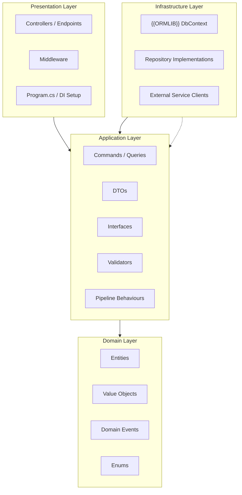
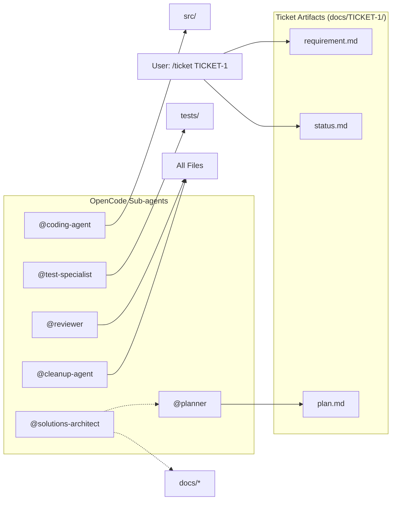
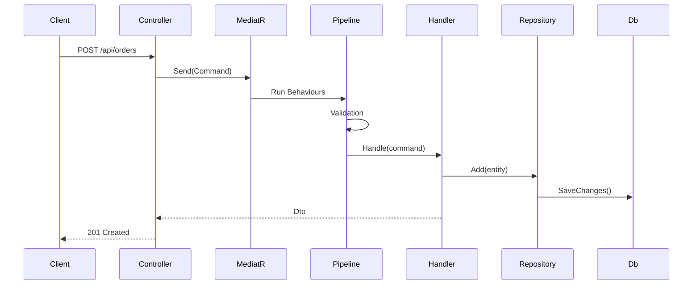

# Solution Architecture

Maintained by `@solutions-architect`. Update whenever the architecture
changes.

## Architecture Overview



## Dependency Rule

```
Domain (zero dependencies)
    ^
Application (depends on Domain only)
    ^
Infrastructure (depends on Application)
    ^
Presentation (depends on Application)
```

## OpenCode Agent Workflow



## CQRS Flow


