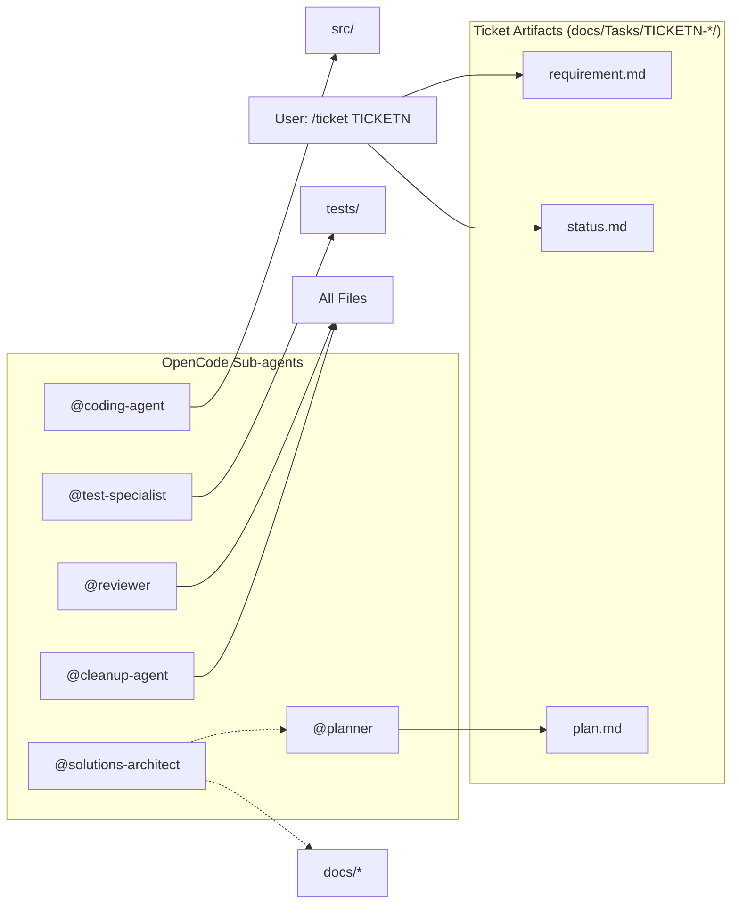

# Solution Architecture

Maintained by `@solutions-architect`. Update whenever the architecture
changes.

## Architecture Overview

{{ARCHITECTURE_DIAGRAM}}

## Dependency Rules

{{DEPENDENCY_RULES}}

## Project Roles

{{PROJECT_ROLES_TABLE}}

## OpenCode Agent Workflow

